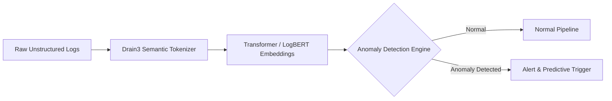

# Event Intelligent System

A high-performance, resilient log analysis and diagnostic engine that ingests raw machine event logs, handles out-of-order and corrupt records, diagnoses device health, isolates root causes with confidence scoring, and generates actionable technical recommendations via CLI and a FastAPI REST interface.

---

## Setup

### Prerequisites
- **Python 3.10+** (Python 3.10, 3.11, or 3.12 recommended)
- **pip** package manager

### 1. Clone the Repository
```bash
git clone <repository-url>
cd event_intelligent_system
```

### 2. Create and Activate a Virtual Environment
- **On Linux / macOS:**
  ```bash
  python3 -m venv venv
  source venv/bin/activate
  ```
- **On Windows (PowerShell):**
  ```powershell
  python -m venv venv
  .\venv\Scripts\Activate.ps1
  ```
- **On Windows (Command Prompt):**
  ```cmd
  python -m venv venv
  .\venv\Scripts\activate.bat
  ```

### 3. Install Dependencies
Install all required packages from `requirements.txt`:
```bash
pip install -r requirements.txt
```

#### Included Core Dependencies:
| Package | Purpose |
| :--- | :--- |
| `fastapi` | High-performance asynchronous REST API framework |
| `uvicorn` | ASGI web server for hosting the FastAPI application |
| `python-multipart` | Multipart streaming parser for log file uploads |
| `loguru` | Structured, rotating application file and console logging |
| `pytest` | Automated unit, integration, and edge-case testing framework |

---

## Execution

The system provides three primary execution modes: Command-Line Interface (CLI), REST API Service (with interactive Swagger UI), and the automated Pytest test suite.

### 1. Command-Line Interface (CLI)
Run the standalone diagnostic engine directly from your terminal:
```bash
python src/main.py
```
*(Or as a module: `python -m src.main`)*

**What happens:**
1. Loads raw events from the configured input file (`sample_data/events.log`).
2. Sanitizes noisy records and sorts events chronologically per device.
3. Computes system-wide summary and per-device root cause diagnoses.
4. Outputs the formatted JSON diagnosis report directly to the terminal stdout.
5. Persists a timestamped JSON report to `output/OUTPUT_<YYYY-MM-DD>_<HH-MM-SS>.json`.
6. Appends detailed execution telemetry to `logs/LOG_<YYYY-MM-DD>.log`.

---

### 2. REST API Service & Interactive Swagger UI
Launch the FastAPI service powered by Uvicorn:
```bash
python src/api.py
```
*(Or as a module: `python -m src.api`)*

The server will start on `http://127.0.0.1:5000`.

- **Interactive Swagger UI Documentation**: [http://127.0.0.1:5000/docs](http://127.0.0.1:5000/docs)
- **ReDoc Documentation**: [http://127.0.0.1:5000/redoc](http://127.0.0.1:5000/redoc)

#### API Endpoints Overview:
| Method | Endpoint | Description |
| :--- | :--- | :--- |
| `POST` | `/analyze` | Upload a custom `.log` / `.txt` file (or analyze default `sample_data/events.log`). Saves timestamped JSON report and returns analysis. |
| `GET` | `/summary` | Returns high-level metrics (`total_devices`, `healthy_devices`, `failed_devices`). |
| `GET` | `/device/{device_id}` | Returns granular diagnostic status and recommendations for a specific device (e.g., `/device/DEVICE-01`). |

#### Example cURL Requests:
- **Run diagnosis via upload**:
  ```bash
  curl -X POST "http://127.0.0.1:5000/analyze" -F "file=@sample_data/events.log"
  ```
- **Fetch health summary**:
  ```bash
  curl -X GET "http://127.0.0.1:5000/summary"
  ```
- **Query specific device diagnosis**:
  ```bash
  curl -X GET "http://127.0.0.1:5000/device/DEVICE-01"
  ```

---

### 3. Automated Test Suite
Run the full test suite verifying edge cases, malformed log lines, out-of-order sequences, retries, and confidence calculations:
```bash
python -m pytest -v
```

---

## Architecture

The system processes logs through a modular 4-stage pipeline:
1. **Ingestion & Cleaning**: Cleans noisy lines and safely ignores corrupt records.
2. **Grouping & Sorting**: Groups events by device and sorts them in correct time order.
3. **Diagnostics & Root Cause Analysis**: Identifies device health, root causes, and confidence scores.
4. **Reporting & API Serving**: Delivers easy-to-read JSON reports via CLI and REST API.

> [!NOTE]
> For the complete visual architecture diagram and technical component breakdown, please see:
> **[Architecture Diagram & Detailed Workflow](architecture/architecture_diagram.md)**.

---

## Design Decisions (In Plain English)

### 1. Why We Selected This Approach
- **Clean Step-by-Step Flow**: We divided the work into clear, independent steps: read data $\rightarrow$ clean errors $\rightarrow$ analyze issues $\rightarrow$ deliver the report.
- **Doesn't Crash on Bad Data**: Real-world log files often have typos, missing fields, or crazy dates (like `2026-99-99`). Instead of crashing, our system skips broken lines and keeps processing everything else.
- **Convenient for Everyone**: Engineers can run it directly in their terminal (`python src/main.py`) or use an interactive web interface with clickable buttons (`http://127.0.0.1:5000/docs`).

### 2. How Failures Are Detected
- The system inspects every single event recorded for a device.
- If **any** event is marked as **`FAILED`**, the device is flagged as **`FAILED`**.
- If all events succeeded without problems, the device is marked **`HEALTHY`**.

### 3. How Root Cause Is Determined
- **Put Events in Time Order**: Logs often arrive out of sequence due to network lag. We sort all events chronologically first so we see the exact sequence of events.
- **Find the First Domino**: When a device fails, several errors usually follow like falling dominoes. We find the **very first failure** in the timeline, which reveals the true root cause (such as a bad password or disconnected cable) rather than a downstream symptom.
- **Confidence Score**: If a device failed and repeatedly retried, our confidence in the diagnosis rises (from 75% up to 98%) because repeated attempts prove it is a persistent problem, not a momentary glitch.
- **Actionable Checklist**: Based on what failed, the system provides a clear, human-readable checklist so technicians know immediately what to inspect and fix.

### 4. How the Application Can Scale
- **Divide and Conquer**: Each device's logs are completely independent. To handle millions of devices, we can split them across multiple computers working simultaneously.
- **Conveyor-Belt Processing**: Rather than reading a static file on disk, the system can plug into a live data stream (like Kafka) to analyze events the second they happen.
- **Cloud Storage**: Results can be stored in fast cloud databases (like ClickHouse or BigQuery) for instant searching across millions of devices.

### 5. Limitations of This Solution
- **Memory Usage with Giant Files**: Currently, the system loads files into the computer's memory. Extremely large files (several gigabytes) would need to be split into chunks before analysis.
- **Fixed Rules for Known Issues**: The system recognizes predefined common problems (like login or connection issues). Completely unfamiliar or brand-new error types will simply be classified as a "General Failure".
- **Device Clock Accuracy**: If an edge device has an incorrect clock, its events could be placed slightly out of chronological order.

---

## AI Extension

The modular architecture of the Event Intelligent System provides a strong foundation for evolution into an enterprise-grade, autonomous, AI-driven diagnostic and self-healing platform. Below is a roadmap for extending the system:

### 1. Unsupervised Anomaly Detection (Zero-Rule Failure Discovery)
- **Log Template Extraction**: Integrate log semantic parsers like **Drain3** to tokenize unstructured log messages into parameterized templates dynamically.
- **Sequence Embedding with LogBERT / Transformer Encoders**: Encode chronological event sequences into semantic embeddings. Deep learning models (such as Autoencoders, Isolation Forests, or LogBERT) can detect abnormal event sequences, unusual execution paths, or anomalous inter-event latencies without requiring pre-defined rule mappings.



### 2. Predictive Failure Forecasting (Early Warning Telemetry)
- **Time-Series Telemetry Analysis**: Train Recurrent Neural Networks (LSTMs) or Temporal Fusion Transformers (TFT) on sliding temporal windows of device events.
- **Early Degradation Signals**: By monitoring pre-failure telemetry (e.g., subtle increases in retry cadence, intermittent heartbeat jitter, memory degradation), the AI can predict device failure probability $N$ minutes before total failure occurs, enabling preventive mitigation.

### 3. LLM-Powered Root Cause Analysis & Autonomous Incident Summaries
- **Contextual Incident Prompting**: When an anomaly or complex cascade occurs, aggregate the device’s historical context, configuration changes, and active telemetry into a structured prompt.
- **RAG over Runbooks & Post-Mortems**: Connect an LLM (such as **Gemini 1.5 Pro / Flash**) to a Retrieval-Augmented Generation (RAG) vector index containing internal system architecture documentation, historical JIRA incident tickets, and standard operating procedures (SOPs).
- **Output**: The LLM synthesizes a human-like incident report explaining *why* the failure happened, its broader blast radius, and exact remediation commands for on-call engineers.

### 4. Closed-Loop Automated Remediation (Self-Healing System)
- **AI Action Agent**: Connect the diagnostic output to an execution agent equipped with safe operational toolkits (e.g., device soft reboot, dynamic TLS certificate refresh, route re-assignment, session pool expansion).
- **Confidence-Gated Execution**:
  - High confidence ($> 95\%$) & low risk: Automatically trigger remediation webhook.
  - Medium confidence or high-impact action: Draft resolution plan and prompt the human operator via Slack / PagerDuty with one-click approval (Human-in-the-Loop).
