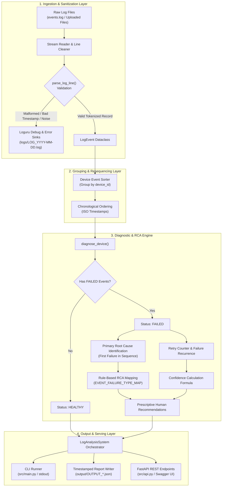

# System Architecture & Workflow Diagram

This document details the architectural design, layered data processing pipeline, and component responsibilities for the **Event Intelligent System**.

---

## High-Level Architecture Diagram

---

## Detailed Pipeline Stages

### 1. Ingestion & Sanitization Layer
- **Input Sources**: Ingests files via batch CLI (`sample_data/events.log`) or HTTP multipart upload (`POST /analyze`).
- **Resilient Line Parsing**: Strips unwanted trailing commas, dots, and whitespace (`parse_log_line`).
- **Data Validation**: Checks token structure (5 columns: `date`, `time`, `device_id`, `event_type`, `status`) and ensures valid ISO timestamps (`YYYY-MM-DD HH:MM:SS`).
- **Error Isolation**: Broken timestamps (e.g., `2026-99-99`) or missing tokens are logged to Loguru debug sinks and skipped without failing the job.

### 2. Grouping & Resequencing Layer
- **Device Partitioning**: Events are grouped in-memory by `device_id`.
- **Chronological Sorting**: Raw logs often arrive out of sequence due to network delays or multi-threaded logger flushes. The engine sorts each device's timeline strictly by timestamp before analysis to guarantee causal integrity.

### 3. Diagnostic & Root Cause Analysis (RCA) Engine
- **Health Determination**: Devices with no `FAILED` status are marked `HEALTHY`.
- **First-Failure Root Cause Isolation**: Cascading errors are avoided by pinpointing the *first* chronologically failing event in the sequence.
- **Classification Mapping**: Translates raw event types into standardized failure domains (`SESSION_ESTABLISHMENT`, `AUTHENTICATION`, `DATA_TRANSMISSION`, `CONNECTION_DROP`).
- **Confidence Scoring**: Starts at 75% base confidence, adding 5% for every logged retry attempt up to 98%.
- **Actionable Recommendations**: Attaches clear troubleshooting steps for engineering teams based on the identified failure type.

### 4. Output & Serving Layer
- **CLI Output**: Formatted JSON printed to standard output for scripting.
- **Persistent Reports**: Saved as `output/OUTPUT_<Date>_<Time>.json`.
- **FastAPI REST API**: Interactive OpenAPI Swagger documentation (`/docs`), device-level lookups (`/device/{device_id}`), and overall summary stats (`/summary`).

---

## Component Responsibilities

| File | Primary Role |
| :--- | :--- |
| `src/config.py` | Central settings, status definitions, error mapping dictionaries, and Loguru logging sinks. |
| `src/analyzer.py` | Core engine containing `LogEvent` schema, line cleaner, chronological sorter, RCA logic, and report generator. |
| `src/main.py` | CLI execution entry point for offline batch log analysis. |
| `src/api.py` | Asynchronous FastAPI service exposing REST endpoints and Swagger UI documentation. |
